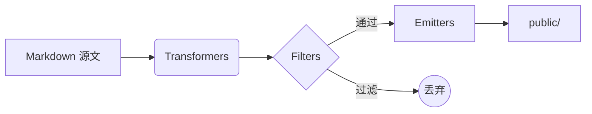
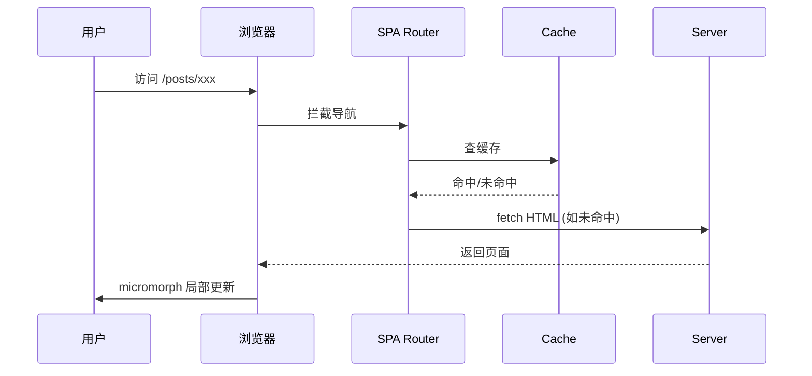

这一页把 Quartz 当前配置支持的所有 Markdown / Obsidian 语法塞在一起，用来检验[[posts/关于Quartz的笔记|主题样式]]在真实长文里的表现。可以从右侧 Table of Contents 跳到任意一节。

## 1. 标题层级

下面是 h2 到 h6（h1 由 frontmatter `title` 自动渲染，不在正文里写）。

### 三级标题 H3

#### 四级标题 H4

##### 五级标题 H5

###### 六级标题 H6

## 2. 段落与强调

普通段落，行间距由主题控制。**这是粗体**，*这是斜体*，***粗斜体***，~~删除线~~，==高亮文本==，行内出现 `inline code` 时观察衬线/字宽匹配。

夹杂中文测试：在中文段落中混入 **bold English**、*italic words*、~~deprecated~~ 以及 `process.env.NODE_ENV` 这种行内代码，看 CJK 与拉丁字体的基线对齐与字号差。

> 单层引用：长引用用来观察行高、左侧引用线颜色以及与正文的对比度。
> 第二行接续。

> 嵌套引用第一层。
>
> > 嵌套引用第二层，用来看缩进与递进色块。
> >
> > > 第三层，验证最深一级的视觉降权是否合理。

---

## 3. 列表

### 无序列表

- 一级 A
  - 二级 A-1
    - 三级 A-1-a
  - 二级 A-2
- 一级 B
- 一级 C，带 **粗体** 与 `code` 与 [外链](https://quartz.jzhao.xyz/)

### 有序列表

1. 准备 frontmatter
2. 在 `content/` 下新建 markdown
3. `npx quartz build --serve` 预览
   1. 修改文件
   2. 浏览器自动 reload
4. `git push` 部署

### 任务列表

- [x] 写完基础语法
- [x] 加入 callout
- [ ] 配 Mermaid 图（需开启 `mermaid` 选项）
- [ ] 加 RSS 自定义封面

## 4. 链接

- 外链：[Quartz 官网](https://quartz.jzhao.xyz/)
- 自动链接：<https://github.com/jackyzha0/quartz>
- 站内 wikilink：[[posts/为什么写数字花园]]
- wikilink 带别名：[[posts/关于Quartz的笔记|查看 Quartz 速查表]]
- wikilink 指向章节：[[posts/关于Quartz的笔记#改动入口速查]]
- 不存在的 wikilink（应显示为红色 / broken）：[[这个页面还没写]]

## 5. 图片

### 5.1 默认样式（圆角 + 阴影 + 悬停轻微放大）


*图 1：默认样式——`` 写法，鼠标移上去会轻微放大，点击可全屏 lightbox 查看*

### 5.2 Obsidian 嵌入指定宽度

![[https://picsum.photos/seed/quartz2/600/400|400]]

### 5.3 居中包裹（`<div class="image-center">`）

<div class="image-center">


*图 3：用 `<div class="image-center">` 包起来，图小于正文宽时居中显示*

</div>

### 5.4 多图并排——画廊行（`<div class="image-row">`）

固定高度、宽度按原始比例自动算，像 Flickr/Google Photos 那样：

<div class="image-row">


</div>

*三张图等高 200px，宽度自然——宽图占地宽、竖图占地窄，整体协调*

### 5.4b 瀑布流（`<div class="image-masonry">`）

适合多张图的画廊，按列从上往下流，自动避免行内对齐参差。**推荐裸 HTML 写图并带上 `width`/`height` 属性**，浏览器能在图加载前就算好布局：

<div class="image-masonry">


</div>

*6 张远程图，未手动标 W/H——由 `Head.tsx` 的客户端脚本在 `onload` 时回写 `naturalWidth`/`naturalHeight`，触发瀑布流重排。如果是本地图（`![[xxx.png]]` 或 ``），由 `ImageDimensions` 插件在构建时就注入 W/H，首屏就到位。*

### 5.5 视频与音频嵌入

> [!warning] OFM 的 `![[]]` 写法对本地视频/音频有坑
>
> Obsidian 风格 `![[demo.mp4]]` 会被 Quartz 转成 `<video src="demo.mp4" controls>`，但 src 不会走 CrawlLinks 路径修正，浏览器会按当前页面解析成相对路径 404。
>
> **本地媒体一律用裸 HTML + 根相对路径**：

```markdown
<video controls width="100%" preload="metadata">
  <source src="/attachments/demo.mp4" type="video/mp4">
</video>

<audio controls preload="metadata">
  <source src="/attachments/song.mp3" type="audio/mpeg">
</audio>
```

要求：文件放在 `content/attachments/`（Quartz 的 `Assets` emitter 会自动拷贝到 `public/`），src 写**带前导斜杠的根相对路径**。

### 5.6 远程大图（测试懒加载 + lightbox 缩放）

下面四张是高分辨率远程图（2000+ 像素），用来验证：① `loading="lazy"` 视口外不下载；② 客户端兜底注入 W/H 后瀑布流不抖动；③ lightbox 打开后能完整放大查看；④ 滚动到视口内才触发渲染。

<div class="image-masonry">


</div>

### 5.7 远程视频（HTML `<video>` 直接嵌）

本地或远程都用裸 HTML 最稳（见 § 5.5 的坑说明）：

<video controls preload="metadata" width="100%" poster="https://picsum.photos/seed/poster/1280/720">
  <source src="https://commondatastorage.googleapis.com/gtv-videos-bucket/sample/BigBuckBunny.mp4" type="video/mp4">
  你的浏览器不支持 HTML5 video。
</video>

*视频源：Big Buck Bunny（CC-BY 3.0，Google 公共桶）。`preload="metadata"` 表示只下载视频元信息（封面、时长），不预加载内容，节省带宽。*

### 5.8 远程音频

<audio controls preload="metadata">
  <source src="https://download.samplelib.com/mp3/sample-15s.mp3" type="audio/mpeg">
  你的浏览器不支持 HTML5 audio。
</audio>

*samplelib.com 的 15 秒测试音频。*

### 5.9 YouTube 嵌入

裸 `<iframe>` 包在 `.video-embed` 容器里实现 16:9 响应式：

<div class="video-embed">
<iframe src="https://www.youtube-nocookie.com/embed/jNQXAC9IVRw" title="Me at the zoo" frameborder="0" allow="accelerometer; clipboard-write; encrypted-media; gyroscope; picture-in-picture; web-share" allowfullscreen loading="lazy"></iframe>
</div>

*"Me at the zoo"——YouTube 上传的第一支视频（2005 年）。用 `youtube-nocookie.com` 域名而不是 `youtube.com`，加载更少追踪 cookie，更合规。`loading="lazy"` 让首屏不阻塞。*

### 5.10b 本地视频 / 音频（治本插件验证）

下面两个媒体是真实本地文件（`content/attachments/`），用 Obsidian `![[]]` 写法。`MediaPaths` 插件会自动注入 `controls` + `preload="metadata"`，CrawlLinks + MediaPaths 会修 src 为根相对路径。

**本地视频（`![[attachments/sample-5s.mp4]]`）：**

![[attachments/sample-5s.mp4]]

**本地音频（`![[attachments/sample-3s.mp3]]`）：**

![[attachments/sample-3s.mp3]]

打开 DevTools 看：
- `<video>` / `<audio>` 都有 `controls` 和 `preload="metadata"` 属性
- `src` 路径正确指向 `/attachments/...`
- Network 面板能看到 2.7MB mp4 和 51KB mp3 各请求一次，状态 200

### 5.10 X / Twitter 嵌入

Twitter 官方 embed 走 `<blockquote class="twitter-tweet">` + 一个 widgets.js 脚本。X 改名后接口仍然兼容：

<blockquote class="twitter-tweet" data-theme="light">
  <p lang="en">just setting up my twttr</p>
  &mdash; jack (@jack) <a href="https://twitter.com/jack/status/20">March 21, 2006</a>
</blockquote>
<script async src="https://platform.twitter.com/widgets.js" charset="utf-8"></script>

> [!warning] 嵌入限制
>
> - **需要联网**：widgets.js 从 Twitter/X 加载，被墙 / 拦截时不会渲染（会留下 blockquote 原始文字 + 链接 fallback）
> - **跨站脚本 + cookie**：会被部分隐私插件（uBlock 等）拦截
> - **不要嵌太多**：每条都创建独立 iframe，5+ 会拖累首屏
> - **替代方案**：截图 + 链接到原推；或用 [react-tweet](https://react-tweet.vercel.app/) 构建时静态化（需引入新依赖）

## 6. 代码

### 行内代码

文本中嵌入 `const greeting = "hello"`、文件名 `quartz.config.ts`、命令 `npx quartz build`。

### 代码块（语法高亮）

```ts
import { QuartzTransformerPlugin } from "../types"

// 一个最小的 transformer 例子
export const MyPlugin: QuartzTransformerPlugin = () => ({
  name: "MyPlugin",
  markdownPlugins() {
    return [
      () => (tree) => {
        // visit / mutate tree
        return tree
      },
    ]
  },
})
```

```python
def fibonacci(n: int) -> list[int]:
    """生成前 n 个斐波那契数。"""
    seq = [0, 1]
    while len(seq) < n:
        seq.append(seq[-1] + seq[-2])
    return seq[:n]


print(fibonacci(10))
```

```bash
# Shell 高亮
rg "TODO" content/ --type md | head -20
git log --oneline -10
```

```json
{
  "name": "demo",
  "scripts": { "dev": "quartz build --serve" }
}
```

### 带文件名 + 行高亮（rehype-pretty-code 支持）

````md
```ts title="quartz.config.ts" {3-5}
const config = {
  configuration: {
    pageTitle: "我的数字花园", // 这一行会被高亮
    locale: "zh-CN",
    baseUrl: "example.com",
  },
}
```
````

实际效果（在源文档里把上面那段从 ```` ```` 包裹改成正常 fence 即可）：

```ts title="quartz.config.ts" {3-5}
const config = {
  configuration: {
    pageTitle: "我的数字花园",
    locale: "zh-CN",
    baseUrl: "example.com",
  },
}
```

## 7. 表格

| 插件类型 | 作用 | 何时运行 | 示例 |
| --- | --- | :---: | ---: |
| Transformer | 处理 markdown / HTML AST | 解析阶段 | `Latex` |
| Filter | 决定是否发布 | 过滤阶段 | `RemoveDrafts` |
| Emitter | 写出文件 | 输出阶段 | `ContentIndex` |

观察点：表头加粗、行斑马纹（若有）、对齐方式（居中 / 右对齐）、中英混排时单元格高度。

## 8. Callouts（Obsidian 风格）

> [!note] 笔记
> 普通笔记型 callout，浅色色块 + 图标。

> [!abstract] 摘要
> 用于章节开头的总览。

> [!info] 信息
> 中性提示，蓝色调。

> [!tip] 提示
> 给读者的建议，绿色调。

> [!success] 成功
> 完成态、肯定结论。

> [!question] 问题
> 提出开放性问题。

> [!warning] 警告
> 黄/橙色，需要注意但不致命。

> [!failure] 失败
> 失败 / 反例。

> [!danger] 危险
> 红色，最高级别警示。

> [!bug] Bug
> 已知问题。

> [!example] 示例
> 配合下面的代码示例使用。

> [!quote] 引用
> "We shape our tools, and thereafter our tools shape us." — McLuhan

### 可折叠 callout

> [!info]- 可折叠（默认折起）
> 标题后加 `-` 默认收起，加 `+` 默认展开。展开后是隐藏内容。

> [!tip]+ 可折叠（默认展开）
> 这一段一开始就是展开的，点击标题可以收起。

## 8.5 Mermaid 图表

流程图：



时序图：



## 9. 数学公式（KaTeX）

行内公式：欧拉恒等式 $e^{i\pi} + 1 = 0$，二次方程根 $x = \frac{-b \pm \sqrt{b^2 - 4ac}}{2a}$。

块级公式：

$$
\int_{-\infty}^{\infty} e^{-x^2}\,dx = \sqrt{\pi}
$$

矩阵：

$$
A = \begin{pmatrix}
a_{11} & a_{12} & a_{13} \\
a_{21} & a_{22} & a_{23} \\
a_{31} & a_{32} & a_{33}
\end{pmatrix}
$$

求和与极限：

$$
\lim_{n \to \infty} \sum_{k=1}^{n} \frac{1}{k^2} = \frac{\pi^2}{6}
$$

## 10. 脚注

数字花园是一种非线性写作形式[^garden]，与传统博客的"流"式发布形成对照[^stream]。

[^garden]: 见 Maggie Appleton, _A Brief History & Ethos of the Digital Garden_。
[^stream]: 流与园的对照最早由 Mike Caulfield 在 2015 年的演讲 _The Garden and the Stream_ 提出。

## 11. 分隔线

上一节结束。

---

下一节开始，分隔线用来在长文中切分主题。

## 12. 标签

行内标签：#思考 #写作 #quartz/笔记 ——可以用斜杠做层级。
（标签也会出现在页面顶部的 TagList 里，由 frontmatter `tags:` 提供。）

## 13. Obsidian 隐藏注释

下面这一行在源文件里有 `%%只对作者可见%%`，构建后会被剥掉，正文不显示：

%%这段文字不应该出现在网页上。如果你看到它，说明 ObsidianFlavoredMarkdown 没生效。%%

如果上面这一行什么都没显示，注释生效正常。

## 14. HTML 直写

<details>
<summary>点我展开 HTML details</summary>

也可以直接写 <kbd>Cmd</kbd> + <kbd>K</kbd> 这种键盘快捷键标记，或者 <mark>HTML 高亮</mark>。

</details>

## 15. 链接预览（Popover）

把鼠标悬停在站内链接上会弹出页面预览卡片——比如指向 [[posts/为什么写数字花园]] 的这个链接。这是由 `enablePopovers: true` 控制的。

## 16. 阅读元信息

文章顶部的 ContentMeta 组件会自动算阅读时长、显示日期；右侧 Graph 会把这篇文章和它引用的所有页面连成节点；底部还有由 [[关于本站]] 间接被反向链到这里产生的 Backlinks。

---

> [!success] 检查清单
> 如果以下都正常显示，你的主题配置基本可用：
>
> - 中文衬线/楷体平稳，无回退到无衬线的突兀
> - 代码块背景与正文区分明显但不刺眼
> - Callout 12 种类型颜色可区分
> - 公式 $e^{i\pi}+1=0$ 渲染为正确符号
> - 任务列表前的 checkbox 对齐良好
